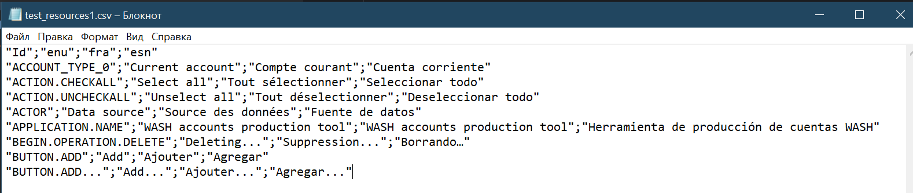
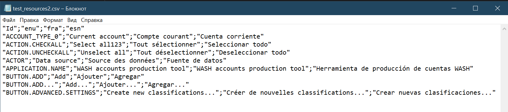
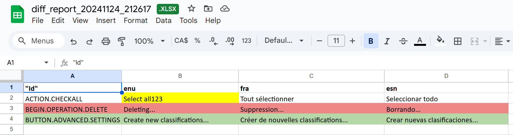

# Csv comparer

It is a tool that allow to find all differences between 2 csv files and present them in Excel-file (.xlsx). 
Initially this tool has been created to compare resource files. Example can be found below. 
All input and output files is located in directories '/input' and '/output' respectively.

First file:

Second file:

Report:
